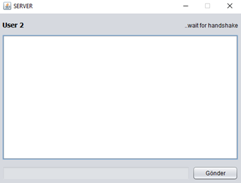
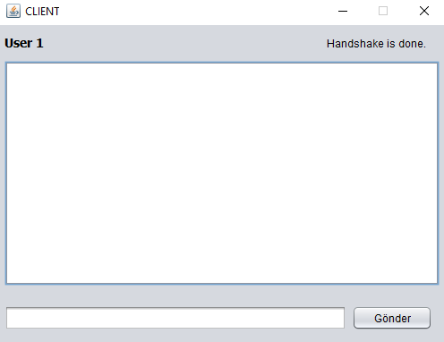
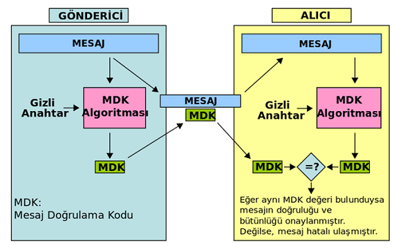
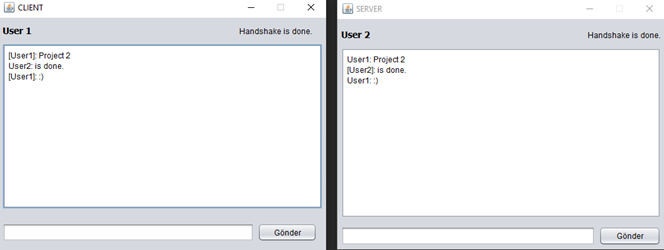

# Encrypted P2P Chat System

Two-user encrypted chat application in Java (Swing), written for a network security course. Communication runs over plain sockets; confidentiality, integrity and authentication are handled step by step.

## 1. Handshake

The server opens a port and the client connects. The client sends its RSA public key; the server replies with a nonce and its own public key. The client encrypts the nonce with its private key and sends it back — if the server recovers the same nonce using the client's public key, the handshake succeeds and the message field is enabled. Otherwise messaging never starts.

## 2. Key generation

After the handshake, both sides generate 128-bit AES keys and exchange them, so each side holds the other's symmetric key.

## 3. Integrity check

Before a message is sent, an HMAC-SHA1 is computed over the message combined with the receiver's symmetric key and sent along with it. The receiver recomputes the MAC and only accepts the message when the two match.

## 4. Message encryption

The message itself is sent AES-encrypted, decrypted on the other side and shown in the chat window.

